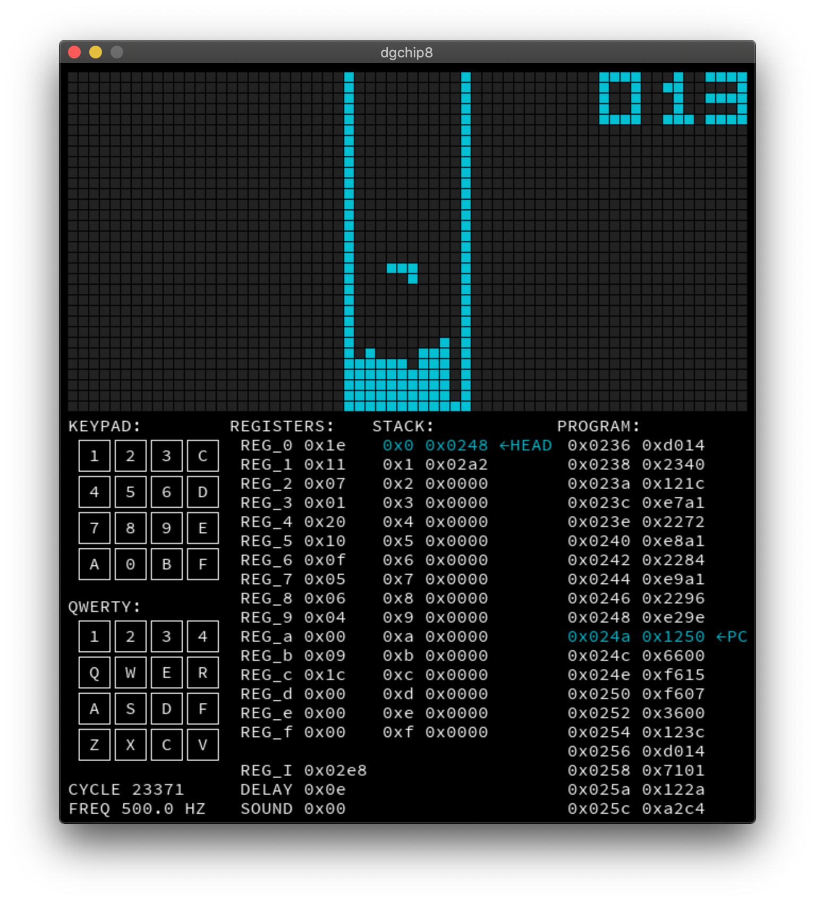

dgCHIP8-sdl
===========

A CHIP8 emulator implementation using [dgCHIP8-go](https://github.com/davgra04/dgCHIP8-go) and [go-sdl2](https://github.com/veandco/go-sdl2).



## Controls

* `K` - pause/resume emulation
* `L` - step emulation (when paused)
* Keypad mapping:

```
 QWERTY                   CHIP8 Keypad          
 --- --- --- ---          --- --- --- --- 
| 1 | 2 | 3 | 4 |        | 1 | 2 | 3 | C |
 --- --- --- ---          --- --- --- --- 
| Q | W | E | R |        | 4 | 5 | 6 | D |
 --- --- --- ---    ->    --- --- --- --- 
| A | S | D | F |        | 7 | 8 | 9 | E |
 --- --- --- ---          --- --- --- --- 
| Z | X | C | V |        | A | 0 | B | F |
 --- --- --- ---          --- --- --- --- 
```
